## Fraudfinder - A comprehensive lab series on how to build a real-time fraud detection system on Google Cloud.

[Fraudfinder](https://github.com/googlecloudplatform/fraudfinder) FraudFinder is a golden Data to AI workshop to show an end-to-end architecture from raw data to MLOps, through the use case of real-time fraud detection. Fraudfinder is a series of labs to showcase the comprehensive Data to AI journey on Google Cloud, through the use case of real-time fraud detection. Throughout the Fraudfinder labs, you will learn how to read historical payment transactions data stored in a data warehouse, read from a live stream of new transactions, perform exploratory data analysis (EDA), do feature engineering, ingest features into a feature store, train a model using feature store, register your model in a model registry, evaluate your model, deploy your model to an endpoint, do real-time inference on your model with feature store, and monitor your model. Below you will find an image of the overall architecture:

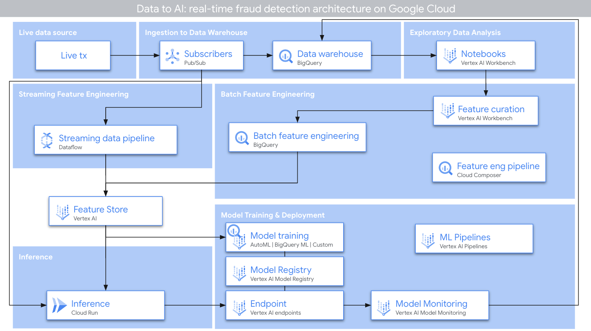

## How to use this repo

This repo is organized across various notebooks as:

* [00_environment_setup.ipynb](00_environment_setup.ipynb)
* [01_exploratory_data_analysis.ipynb](01_exploratory_data_analysis.ipynb)
* [02_feature_engineering_batch.ipynb](02_feature_engineering_batch.ipynb)
* [03_feature_engineering_streaming.ipynb](03_feature_engineering_streaming.ipynb)
* [bqml/](bqml/)
  * [04_model_training_and_prediction.ipynb](bqml/04_model_training_and_prediction.ipynb)
  * [05_model_training_pipeline_formalization.ipynb](bqml/05_model_training_pipeline_formalization.ipynb)
  * [06_model_monitoring.ipynb](bqml/06_model_monitoring.ipynb)

## Creating a Google Cloud project

Before you begin, it is recommended to create a new Google Cloud project so that the activities from this lab do not interfere with other existing projects. 

If you are using a provided temporary account, please just select an existing project that is pre-created before the event as shown in the image below.

It is not uncommon for the pre-created project in the provided temporary account to have a different name. Please check with the account provider if you need more clarifications on which project to choose.

If you are NOT using a temporary account, please create a new Google Cloud project and select that project. You may refer to the official documentation ([Creating and Managing Projects](https://cloud.google.com/resource-manager/docs/creating-managing-projects)) for detailed instructions.

## Running the notebooks

To run the notebooks successfully, follow the steps below.

### Step 0: Select your Google Cloud project
Please make sure that you have selected a Google Cloud project as shown below:
  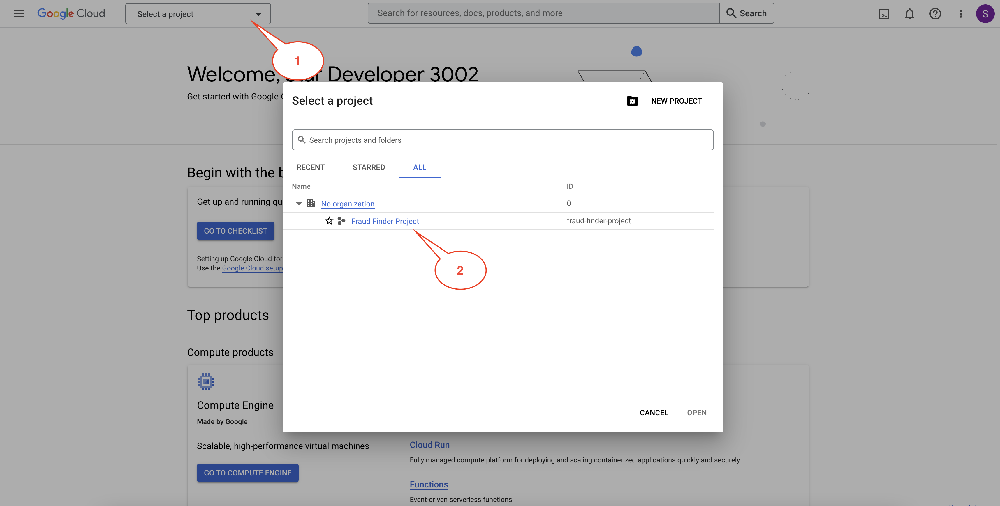

### Step 1: Initial setup using Cloud Shell

- Activate Cloud Shell in your project by clicking the `Activate Cloud Shell` button as shown in the image below.
  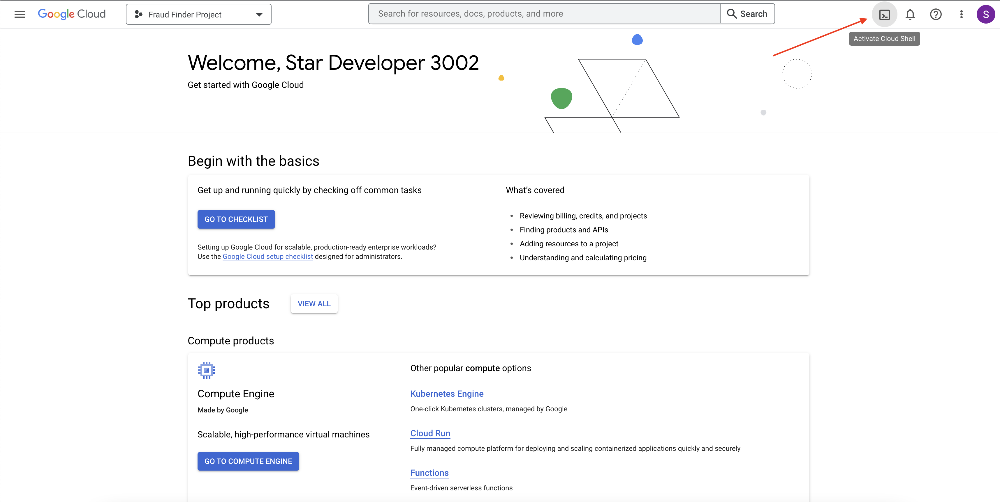

- Once the Cloud Shell has activated, copy the following codes and execute them in the Cloud Shell to enable the necessary APIs, and create Pub/Sub subscriptions to read streaming transactions from public Pub/Sub topics.

- Authorize the Cloud Shell if it prompts you to. Please note that this step may take a few minutes. You can navigate to the [Pub/Sub console](https://console.cloud.google.com/cloudpubsub/subscription/) to verify the subscriptions. 

  ```shell
  gcloud services enable notebooks.googleapis.com
  gcloud services enable cloudresourcemanager.googleapis.com
  gcloud services enable aiplatform.googleapis.com
  gcloud services enable pubsub.googleapis.com
  gcloud services enable run.googleapis.com
  gcloud services enable cloudbuild.googleapis.com
  gcloud services enable dataflow.googleapis.com
  gcloud services enable bigquery.googleapis.com
  gcloud services enable artifactregistry.googleapis.com
  gcloud services enable iam.googleapis.com
  
  gcloud pubsub subscriptions create "ff-tx-sub" --topic="ff-tx" --topic-project="cymbal-fraudfinder"
  gcloud pubsub subscriptions create "ff-tx-for-feat-eng-sub" --topic="ff-tx" --topic-project="cymbal-fraudfinder"
  gcloud pubsub subscriptions create "ff-txlabels-sub" --topic="ff-txlabels" --topic-project="cymbal-fraudfinder"
  
  # Run the following command to grant the Compute Engine default service account access to read and write pipeline artifacts in Google Cloud Storage.
  PROJECT_ID=$(gcloud config get-value project)
  PROJECT_NUM=$(gcloud projects list --filter="$PROJECT_ID" --format="value(PROJECT_NUMBER)")
  gcloud projects add-iam-policy-binding $PROJECT_ID \
        --member="serviceAccount:${PROJECT_NUM}-compute@developer.gserviceaccount.com"\
        --role='roles/storage.admin'
  gcloud projects add-iam-policy-binding $PROJECT_ID \
        --member="serviceAccount:${PROJECT_NUM}@cloudbuild.gserviceaccount.com"\
        --role='roles/aiplatform.admin'
  gcloud projects add-iam-policy-binding $PROJECT_ID \
        --member="serviceAccount:$PROJECT_NUM-compute@developer.gserviceaccount.com"\
        --role='roles/run.admin'
  gcloud projects add-iam-policy-binding $PROJECT_ID \
        --member="serviceAccount:$PROJECT_NUM-compute@developer.gserviceaccount.com"\
        --role='roles/resourcemanager.projectIamAdmin'
  gcloud projects add-iam-policy-binding $PROJECT_ID \
        --member="serviceAccount:service-${PROJECT_NUM}@gcp-sa-aiplatform.iam.gserviceaccount.com"\
        --role='roles/artifactregistry.writer'
  gcloud projects add-iam-policy-binding $PROJECT_ID \
        --member="serviceAccount:service-${PROJECT_NUM}@gcp-sa-aiplatform.iam.gserviceaccount.com"\
        --role='roles/storage.objectAdmin'   
  ```

#### Step 2: Create a User-Managed Notebook instance on Vertex AI Workbench

- Browse to [Vertex AI Workbench](https://console.cloud.google.com/vertex-ai/workbench/list/instances) page, Click on "**USER-MANAGED NOTEBOOKS**" and Click on "**+ NEW NOTEBOOK**" as shown in the image below.
  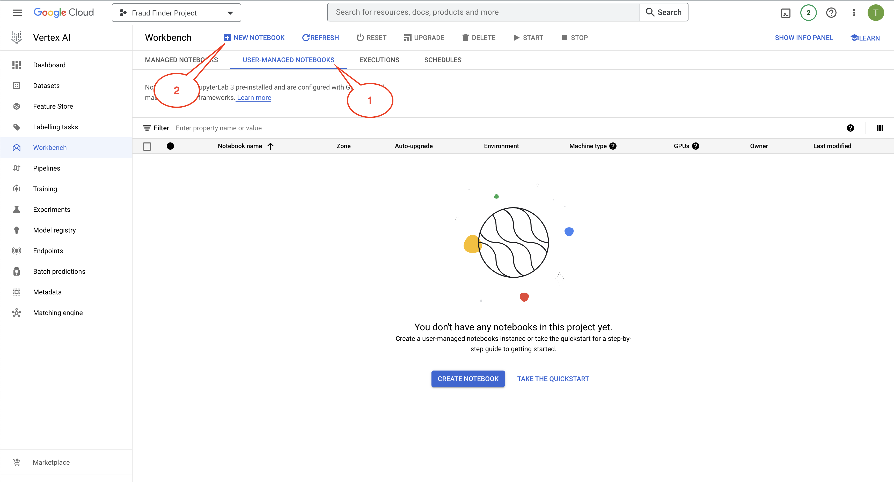
  
- Please make sure you have selected the correct project when creating a new notebook. Upon clicking the "**+ NEW NOTEBOOK**", you will be presented with a list of notebook instance options. Select `Python 3`
  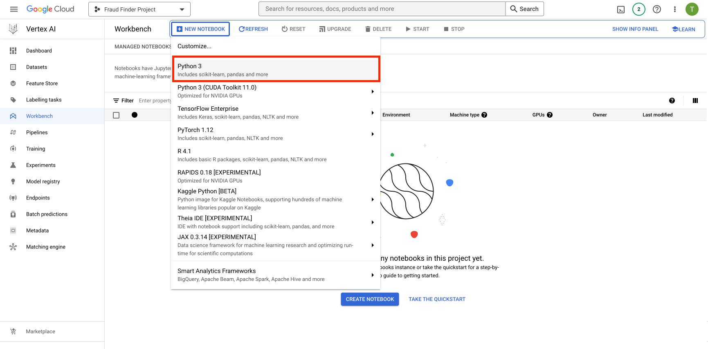

- Pick a name (or leave it default), select a location, and then click "**CREATE**" to create the notebook instance.
  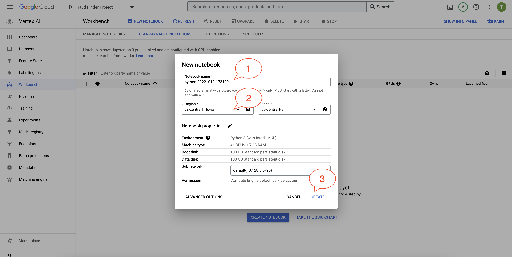

- The instance will be ready when you see a green tick and can click on "**OPEN JUPYTERLAB**" on the [User-Managed Notebooks page](https://console.cloud.google.com/vertex-ai/workbench/list/instances). It may take a few minutes for the instance to be ready.
  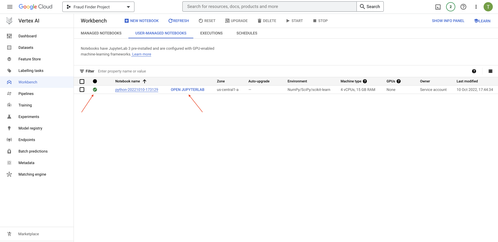

#### Step 3: Open JupyterLab
- Click on "**OPEN JUPYTERLAB**", which should launch your Managed Notebook in a new tab.

#### Step 4: Opening a terminal

- Open a terminal via the file menu: **File > New > Terminal**.
  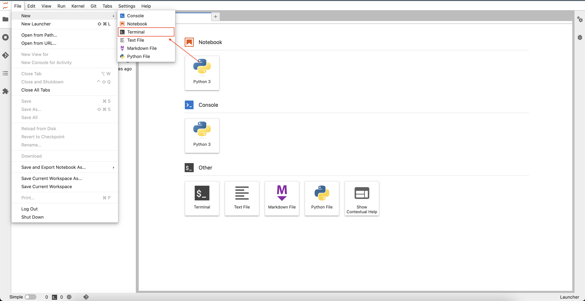
  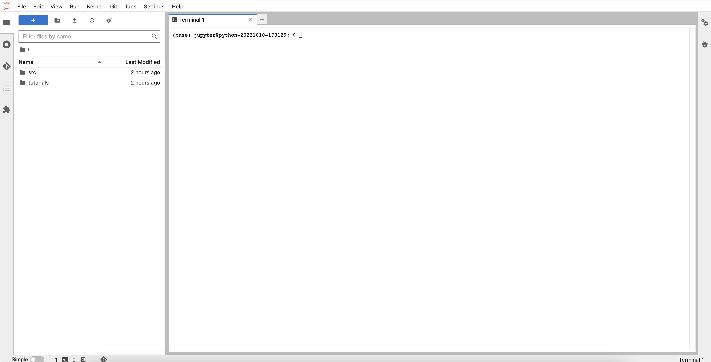
#### Step 5: Cloning this repo

- Run the following code to clone this repo:
  ```
  git clone https://github.com/GoogleCloudPlatform/fraudfinder.git
  ```

- You can also navigate to the menu on the top left of the Jupyter Lab environment and click on **Git > Clone a repository**.

- Once cloned, you should now see the **fraudfinder** folder in your main directory.
  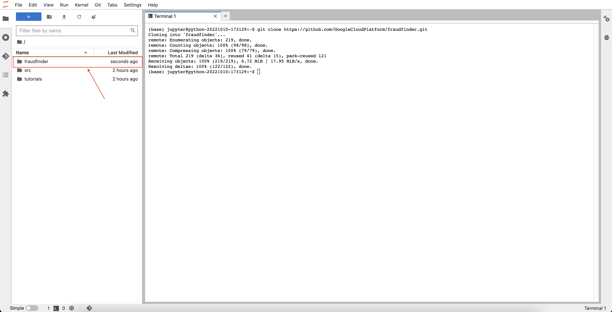


#### Step 6: Open the first notebook

- Open the first notebook: `00_environment_setup.ipynb`
  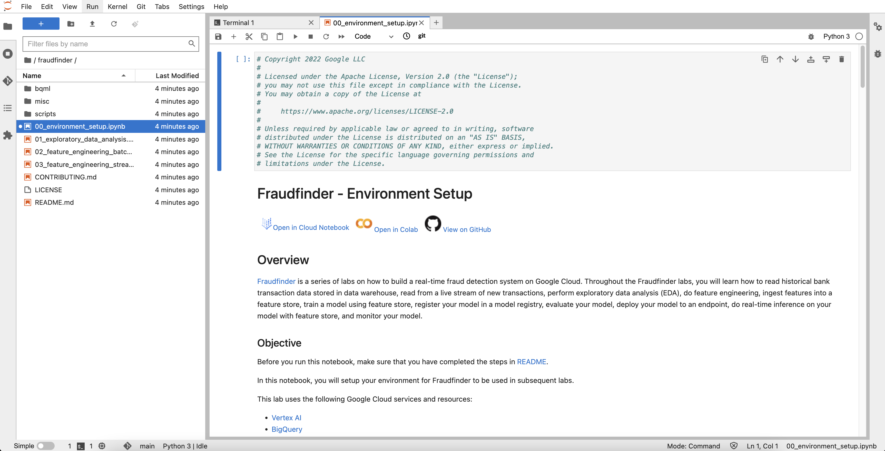

- Follow the instructions in the notebook, and continue through the remaining notebooks. 
